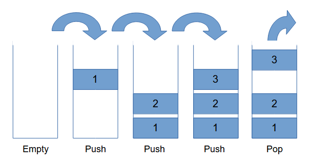

# Stacks

## Introduction
Stacks are characterized as "**Last In, First Out**" data structures. Items put or "**pushed**" onto the top or "**back**" of the stack can't be removed until the more recent elements have been taken or "**popped**" off.



+ Element 1 is pushed onto an empty stack
+ Element 2 is pushed onto element 1
+ Element 3 is pushed onto element 2
+ Finally, element 3 is popped off the stack

## Performance (Big O Notation)
The performance of a stack depends on how it is implemented. 

When the underlying data structure adds and removes elements from the back of the stack, it has a constant big O notation of O(1). Adding more elements to the stack doesn't make it any slower. Likewise, performance remains the same if a linked list is used and operations are performed on the front of the data structure.

On the other hand, performance becomes O(n) when the front of a list or array is used to push and pop elements. This reflects the linear nature of how growing and shrinking the data set also increases the time required by the algorithm to copy and move more items.


## Used For
+ Functions that implement backtracking often use stacks to return to a previous decision point and take an alternate path. 
+ Likewise, when a program has an undo function, it most likely uses a stack to track and revert those changes back to a previous state.

## Disadvantages
Stacks are susceptible to error and can cause a buffer to overflow intentionally or unintentionally when a recursive function calls itself too many times. This can also happen if the data given to a stack is too large for the structure to hold.

## Example: 
In this example, a Python list is used to implement a stack that follows the principle of **"Last In, First Out"**. Although other implementations might use a deque or linked list to do this, this example uses a list. Also, to improve performance, the stack adds and removes items from the end of the list and not the beginning.

```
# create a stack class
class Stack:
  def __init__(self):
    # use a list to hold items
    self.__index = []

  # return number of items in the stack
  def __len__(self):
    return len(self.__index)

  # add item to the end of the stack
  def push(self,item):
    self.__index.append(item)

  # get item from the back of the stack
  def pop(self):
    if len(self) == 0:
       return "pop() called on empty stack."
    else:
        return self.__index.pop()
```

Test out the stack
```
# instantiate a stack object
pancake = Stack()

# add items
pancake.push(1) # bottom
pancake.push(2) # middle
pancake.push(3) # top

# remove items
# the first pancake added is the last one eaten
print("Eat: " + str(pancake.pop()))
print("Eat: " + str(pancake.pop()))
print("Eat: " + str(pancake.pop()))
# time to make more pancakes
print("Eat: " + str(pancake.pop()))
```

Output:
```
Eat: 3
Eat: 2
Eat: 1
Eat: pop() called on empty stack.
```
## Problem to Solve: I Can´t Read This ...


While the good Doctor Frankenstein is away, trusty Igor has been tasked with transcribing the doctor's secret notebook into something more ledgible. Always one to please, Igor needs your help to write a program before the doctor returns.

+ Use a stack to reverse the words and letters in the following message

```
efil fo kraps htiw erutaerc ezinavlaG .5\nrepap dekaos enirb htiw etarapes reppoc dna cniz fo setalp ytrof htiw sthguort eerht esu ,elip ciatlov dliuB .4\nefil fo stnemurtsni tcelloC .3\neussit dna snagro devreserp rehtegot hctitS .2\ndrayhcruhc sarcnaP .tS morf ymotana yrassecen erucorP .1
```
 
+ **Hint:** to work correctly, try adding and removing each letter of the message to and from the stack on its own

[View Sample Solution](solution_stack.py)

---
[Previous](0-welcome.md) | [Next](2-linked.md)