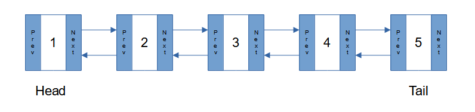

# Linked Lists
## Introduction
Unlike other data structures which store their information in contiguous memory, a linked list stores its information as a series of nodes which can reside anywhere. Each node is linked together to form a chain. The first node in the list is referred to as the "**head**" while the last node in the list is referred to as the "**tail**".



While most linked lists are bi-directional like the one above, it is possible to have a linked list that goes in just one direction.

## Performance (Big O Notation)
The performance of a linked list depends on the action being taken. Because the size of a list makes no difference when adding or removing a node at the beginning or end, the performance is a constant big O with a notation of O(1). 

On the other hand, when adding, removing or searching for a specific node in the list, the time required to reach the desired node increases linearly as the size of the list grows bigger. This results in a notation of O(n).


## Used For
* Linked lists are a good underlying data structure to implement a stack or queue because they offer efficient insertion and removal of elements.
* Linked lists are also good for implementing structures that you know will grow and decrease in size over time.

## Disadvantages
Because nodes in a linked list hold data along with information linking them to other nodes, they have the potential to take up more space when compared with  a structure that only contains data. In addition, since getting from one node to another often means moving to a new space in memory, linked lists can´t take advantage of caching.

## Example: 
Python has its own version of a linked list called a "**deque**", this example uses the built in collection to add and remove numbers.

Test out the linked list
```
import collections

linkedlist = collections.deque([1, 2, 4])
print(linkedlist)
```

Add item
```
# to the back
linkedlist.append(5)
print(linkedlist)

# to the front 
linkedlist.appendleft(0)
print(linkedlist)

# at a specific index
linkedlist.insert(3, 3)
print(linkedlist)
```

Remove item
```
# from the back
linkedlist.pop()
print(linkedlist)

# from the front
linkedlist.popleft()
print(linkedlist)

# with an existing value
linkedlist.remove(4)
print(linkedlist)
```

Output

```
deque([1, 2, 4])
deque([1, 2, 4, 5])
deque([0, 1, 2, 4, 5])
deque([0, 1, 2, 3, 4, 5])
deque([0, 1, 2, 3, 4])
deque([1, 2, 3, 4])
deque([1, 2, 3])
```

## Problem to Solve: Head Bone Connected to ...


Doctor Frankenstein wants Igor to prepare the anatomy he's collected for an upcoming experiment. Igor has the parts, unfortunately, they aren't in the right order. And some are probably unnecessary. Igor needs your help to remove the items that don't belong and to put the ones that do in the correct sequence.

+ Do not use a deque. Instead, model your linked list on the stack you created earlier as a class within a class. This time, write functions to add and remove from both the front and back of the structure along with code to insert and iterate the data. 
+ Use the following items, keeping the same order, to seed your list.

```
+ head
+ brain
+ foot
+ back
+ ankle
+ bolts
+ hip
+ neck
+ leg
+ heart
+ knee
+ heel
+ thigh
+ chewing gum
+ toe
+ shoulder
```
 
+ **Hint:** The correct list and order of parts can be found in verse 2 of [Dem Bones](https://en.wikipedia.org/wiki/Dem_Bones)


[View Sample Solution](linked_solution.py)

---
[Previous](1-stacks.md) | [Next](3-trees.md)