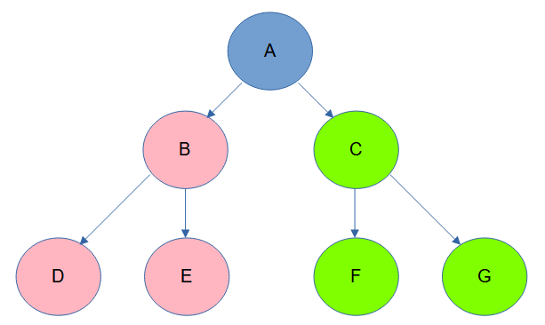

# Trees
## Introduction
Trees are non-linear data structures that begin with a single node. From this top or **"root"** node, other nodes are connected to form a tree. When a tree is traversed from top to bottom, the nodes are referred to as **"children"**. When the tree is climbed from bottom to top, the same nodes become **"parents"**. Any node that does not link to a child node is known as a **"leaf"**.



+ A = root node
+ B, C = child nodes to A
+ B, C = parent nodes to D, E, F, G
+ D, E, F, G = leaf nodes
+ (B, D, E) and (C, F, G) = subtrees

## Performance (Big O Notation)
The performance of a tree depends on whether or not it is balanced. A tree is **"balanced"** When the distance from the root to each leaf is consistent or has the same height.

When a tree is balanced, half of its nodes can be discarded as the tree is traversed. Because the time it takes to search for a node is less than the number of nodes that are added, the resulting notation is O(log n).

## Used For
+ Trees are good for sorting and searching data. They are also used to represent hierarchical data.
+ Operating systems use trees to store files and directories while trees are used by HTML to recreate the DOM.

## Common Errors
Trees lose their performance advantage as they become unbalanced. Likewise, their performance decreases if for some reason every node in a tree needs to be reviewed. 

## Example: 
In this example, a tree is used to store numbers. A series of checks are then made to determine if the number exists in the tree.

```
# create a binary search class
class Tree:

  class Node:
    # initialize root node
    def __init__(self, data):
      # use a list to hold items
      self.data = data
      self.left = None
      self.right = None

  # initialize empty tree
  def __init__(self):
    self.root = None     

  # add information to the tree
  def insert(self, data):
    if self.root is None:
      print("add root: " + str(data))
      self.root = Tree.Node(data)
    else:
      self._insert(data, self.root) # start at the root
  
  # add node
  def _insert(self, data, node):
    # no duplicates
    if data == node.data:
      return False
    elif data < node.data:
      if node.left is None:
        # empty, create new node
        print("add left: " + str(data))
        node.left = Tree.Node(data)
      else:
        # keep looking
        self._insert(data, node.left)
    else:
      if node.right is None:
        # empty, create new node
        print("add right: " + str(data))
        node.right = Tree.Node(data)
      else:
        # keep looking
        self._insert(data, node.right)

  def __contains__(self, data):
    return self._contains(data, self.root)  # Start at the root

  def _contains(self, data, node):
    if data == node.data:
      return True
    elif data < node.data:
      # data belongs on the left side
      if node.left is not None:
        # keep looking, make recursive call on the left sub-tree
        return self._contains(data, node.left)
    else:
      # data belongs on the right side
      if node.right is not None:
        # keep looking, make recursive call on the right sub-tree
        return self._contains(data, node.right)

    # value was never found
    return False

# instantiate a binary tree
numbers = Tree()

# add items
numbers.insert(1)
numbers.insert(7)
numbers.insert(4)
numbers.insert(6)
numbers.insert(5)
numbers.insert(3)
numbers.insert(2)

print(0 in numbers)
print(2 in numbers)
print(9 in numbers)

```
Output:\
False\
True\
False

## Problem to Solve: Lightening Tracker


In order to finally bring his creation to life, Doctor Frankenstein must keep meticulous records of the lightening strikes near his laboratory. He has tasked Igor with recording the information. Once again, Igor needs your help to write a program.

+ Record the following pre UNIX epoch timestamps in a tree for Doctor Frankenstein to reference later. Determine whether lightening struck on 1800-04-09 and 1806-06-22.

```
-4846176000.0
-4828204800.0
-4859395200.0
-4822502400.0
-4888598400.0
-5356195200.0
-4773600000.0
```
 
+ **Hint:** converting pre 1970 dates to timestamps is hard. Here's a sample to make the job easier.
```
date_as_string = (datetime.strptime(date_as_timestamp, '%Y-%m-%d') - datetime(1970, 1, 1)).total_seconds()
```

[View Sample Solution](tree_solution.py)

[Back to Index](0-welcome.md)